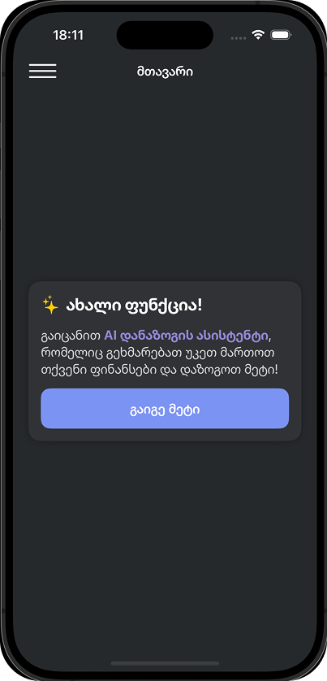

## Introduction
`AI Savings Assistant`  
Overview
The AI Savings Assistant is a feature that helps users manage their finances more effectively by providing personalized savings and spending recommendations. It analyzes the user's current balance and suggests a detailed spending plan based on essential categories like transport, housing, groceries, healthcare, and savings. The assistant ensures that users save a recommended percentage of their income while allocating the remaining funds to necessary expenses.

## 🚀 Key Features:

* Personalized Savings Plan: Based on the user’s current balance, the AI Assistant calculates how much to save and provides suggestions for allocating the rest of the money across essential categories.

* Detailed Spending Breakdown: The AI offers a detailed plan categorizing expenses such as transport, housing, groceries, healthcare, and savings.

* Dynamic Response Parsing: The assistant dynamically responds with a formatted spending plan, which is parsed and displayed clearly in a user-friendly card view.

* Optimized UI: The spending categories, amounts, and descriptions are displayed in a clean, visually appealing format, helping users understand their financial situation at a glance.

| Home | Spending Trends | user Income | Assistant | New Item In Menu|
| --- | --- | --- | --- | --- |
|  |   |  |  |  |

## 🚀 Functional Flow:

User Input: The user provides their current balance to the AI Savings Assistant.
AI Calculation: The assistant calculates the recommended savings (typically 15% of the balance) and allocates the remaining funds to various essential categories, such as transport, housing, groceries, healthcare, etc.
Response Generation: The assistant generates a detailed spending plan based on these calculations.
UI Display: The response is parsed and displayed within a sleek and intuitive UI card, categorizing each spending area with clear amounts and descriptions.

### Built With 

* SwiftUI
ViewModel: The ViewModel in SwiftUI will handle API requests, store the data, and bind the response to the SwiftUI views.
UI Cards: Display the response from the backend in a beautiful, card-based UI.

* Backend (Python Swagger API)

## Contact  

For any questions, feedback, or contributions, feel free to reach out:  

- **Developer:** Nini Kurshavishvili  
- **Email:** [ninikurshavishvili606@gmail.com](ninikurshavishvili606@gmail.com)  
- **GitHub:** [ninikurshavishvili](https://github.com/ninikurshavishvili)  
- **Project Repository:** [BUILDY on GitHub](https://github.com/ninikurshavishvili/SavingsAssistant.git)  

